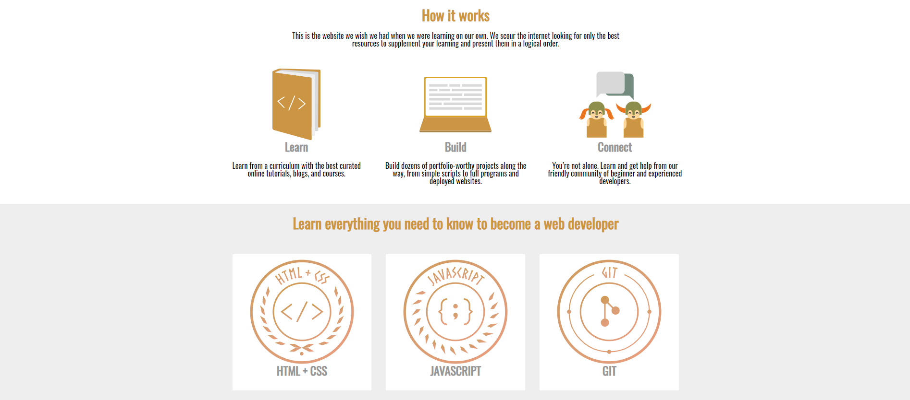

![Issues][issues-shield]

  <h3 align="center">Grid Framework</h3>

  

    This assignment consists of building a grid-based framework (similar to bootstrap) that includes some basic functionality necessary to build a website.

     
    <a href="https://github.com/kazumaki/grid-framework/"><strong>Explore the docs »</strong></a>
     
    ·
    <a href="https://github.com/EdSacasa/grid-framework/issues">Report Bug</a>
    ·
    <a href="https://github.com/EdSacasa/grid-framework/issues">Request Feature</a>
  

<!-- TABLE OF CONTENTS -->
## Table of Contents

* [About the Project](#about-the-project)
  * [Built With](#built-with)
* [Contributing](#contributing)
* [Contact](#contact)

<!-- ABOUT THE PROJECT -->
## About The Project

In this project, we are supposed to build a grid-based CSS framework similar to Bootstrap.

### Built With

* [CSS](CSS)
* [HTML](HTML)

<!-- GETTING STARTED -->
## Getting Started

To get a local copy up and running follow these simple steps.

## Contributing

Contributions are what make the open-source community such an amazing place to learn, inspire, and create. Any contributions you make are **greatly appreciated**.

1. Fork the Project
2. Create your Feature Branch (`git checkout -b feature/AmazingFeature`)
3. Commit your changes (`git commit -m 'Add some AmazingFeature'`)
4. Push to the Branch (`git push origin feature/AmazingFeature`)
5. Open a Pull Request

<!-- CONTACT -->
## Contact

Ed Sacasa - (https://github.com/EdSacasa)  
👤 **Vinicius Campos Carvalho**

- Github: [@kazumaki](https://github.com/kazumaki)
- Twitter: [@iKazumaki](https://twitter.com/iKazumaki)
- Linkedin: [Vinicius Campos Carvalho](https://www.linkedin.com/in/vcamposcarvalho/)
- Email: [vcampos.pitangui@gmail.com](vcampos.pitangui@gmail.com)

Project Link: [https://github.com/EdSacasa/grid-framework](https://github.com/EdSacasa/grid-framework)

<!-- MARKDOWN LINKS & IMAGES -->
<!-- https://www.markdownguide.org/basic-syntax/#reference-style-links -->
[contributors-shield]: https://img.shields.io/github/contributors/othneildrew/Best-README-Template.svg?style=flat-square
[contributors-url]: https://github.com/othneildrew/Best-README-Template/graphs/contributors
[forks-shield]: https://img.shields.io/github/forks/othneildrew/Best-README-Template.svg?style=flat-square
[forks-url]: https://github.com/othneildrew/Best-README-Template/network/members
[stars-shield]: https://img.shields.io/github/stars/othneildrew/Best-README-Template.svg?style=flat-square
[stars-url]: https://github.com/othneildrew/Best-README-Template/stargazers
[issues-shield]: https://img.shields.io/github/issues/othneildrew/Best-README-Template.svg?style=flat-square
[issues-url]: https://github.com/othneildrew/Best-README-Template/issues
[license-shield]: https://img.shields.io/github/license/othneildrew/Best-README-Template.svg?style=flat-square
[license-url]: https://github.com/othneildrew/Best-README-Template/blob/master/LICENSE.txt
[linkedin-shield]: https://img.shields.io/badge/-LinkedIn-black.svg?style=flat-square&logo=linkedin&colorB=555
[linkedin-url]: https://linkedin.com/in/othneildrew
[product-screenshot]: images/screenshot.png
